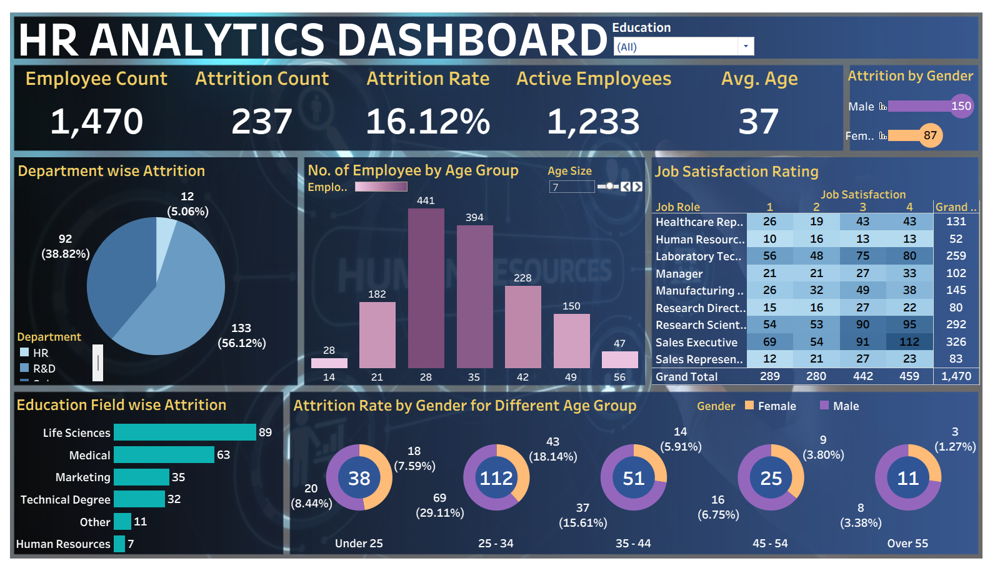

# 📊 HR Analytics Dashboard

## 📌 Project Overview
This project presents an interactive **HR Analytics Dashboard** built to analyze employee data and uncover insights related to attrition, job satisfaction, demographics, and workforce trends.

The dashboard helps organizations make data-driven HR decisions by identifying patterns in employee behavior and attrition.

---

## 🖼️ Dashboard Preview

---

## 🚀 Key Insights
- 👥 Total Employees: **1470**
- 📉 Attrition Count: **237**
- 📊 Attrition Rate: **16.12%**
- 🧑‍💼 Active Employees: **1233**
- 🎂 Average Age: **37**

---

## 📊 Dashboard Features

### 🔹 Employee Overview
- Total employee count  
- Active employees  
- Attrition rate  

### 🔹 Attrition Analysis
- Department-wise attrition  
- Gender-based attrition  
- Age group attrition trends  

### 🔹 Demographics Insights
- Employees by age group  
- Education field-wise attrition  

### 🔹 Job Satisfaction
- Job role vs satisfaction rating matrix  

---

## 🛠️ Tools & Technologies
- Power BI / Data Visualization Tool  
- Data Cleaning & Analysis  
- Dashboard Design  

---

## 📂 Dataset
- HR dataset containing employee details such as:
  - Age  
  - Department  
  - Education  
  - Job Role  
  - Attrition  

---

## 📈 Visualizations Included
- Pie Chart (Department-wise Attrition)  
- Bar Chart (Age Group Distribution)  
- Donut Charts (Attrition by Gender & Age)  
- Heatmap (Job Satisfaction Ratings)  
- KPI Cards  

---

## ⚠️ Challenges
- Handling categorical HR data  
- Extracting meaningful insights from attrition patterns  
- Designing a clean and interactive dashboard  

---

## 🔮 Future Enhancements
- Add predictive analytics for attrition  
- Integrate real-time HR data  
- Deploy dashboard to web  

---

## ⭐ Support
If you found this project useful, give it a ⭐ on GitHub!
